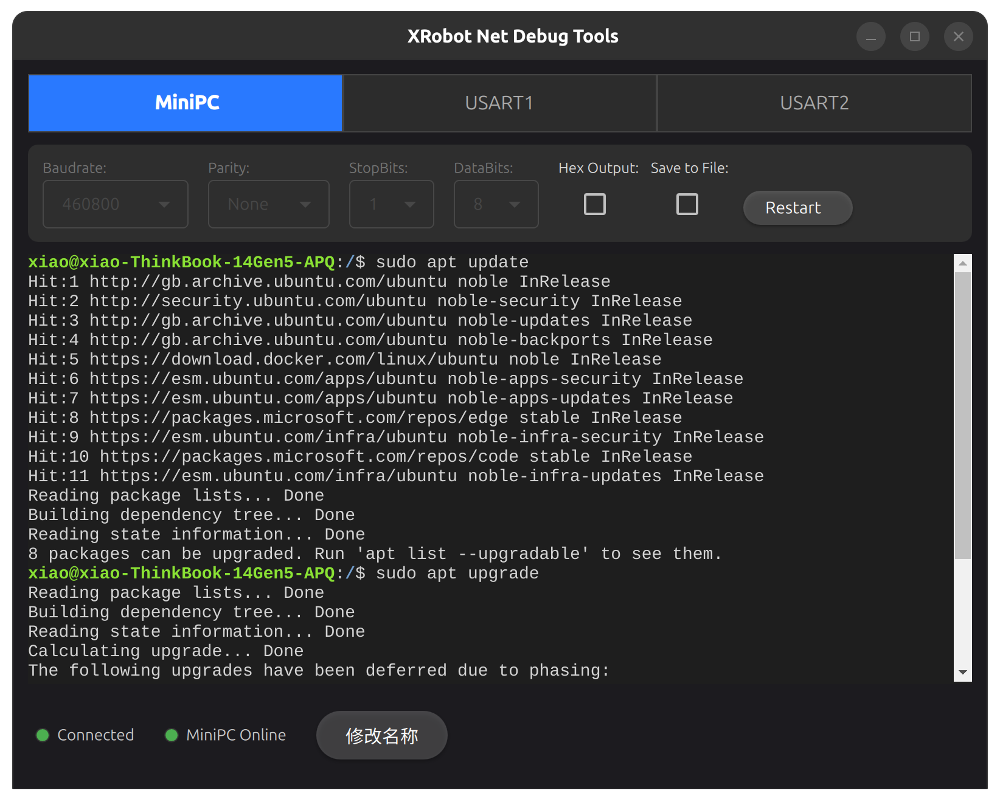
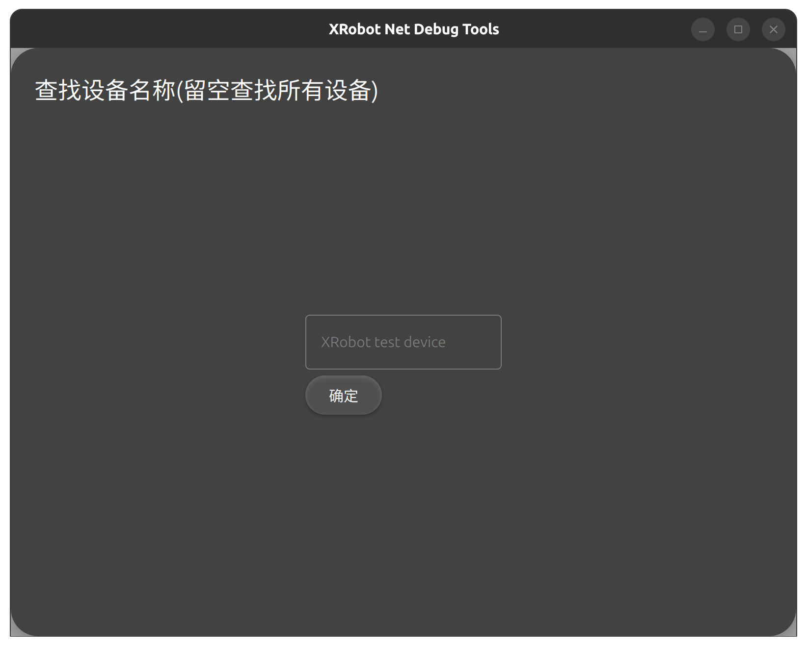
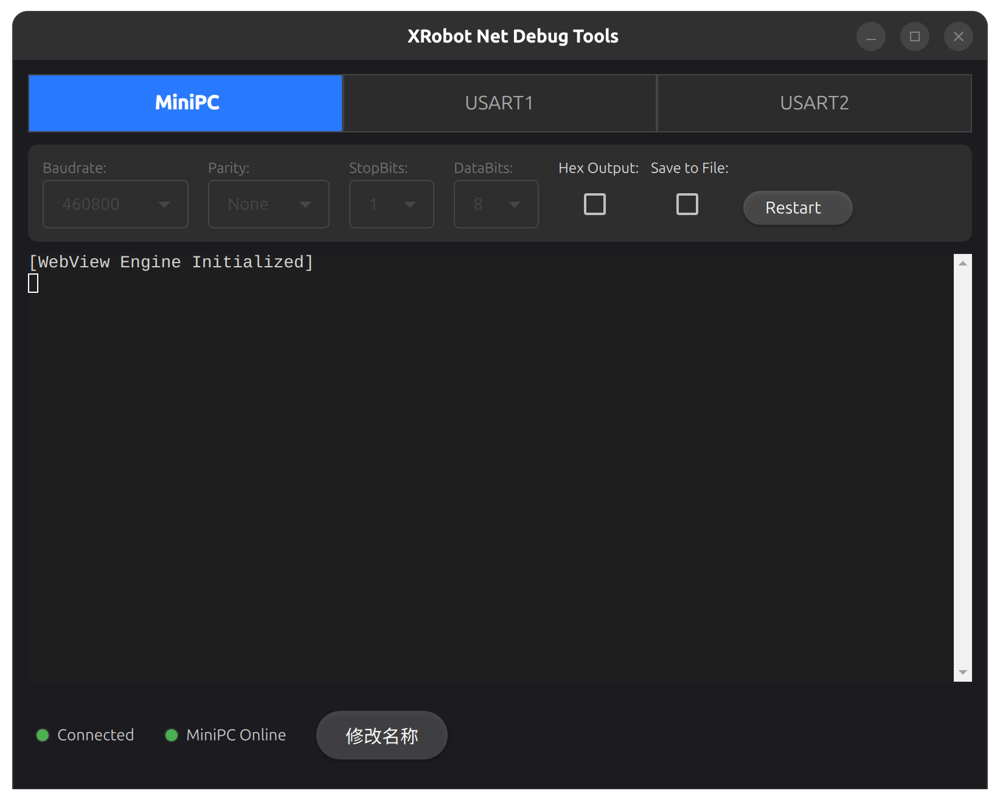
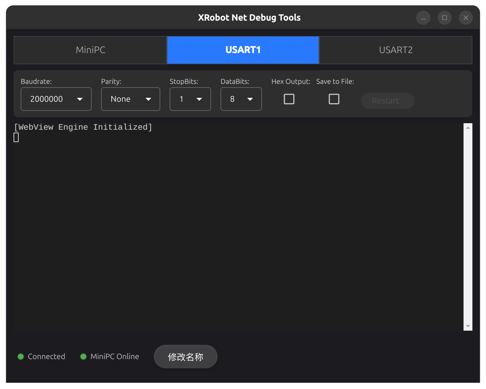
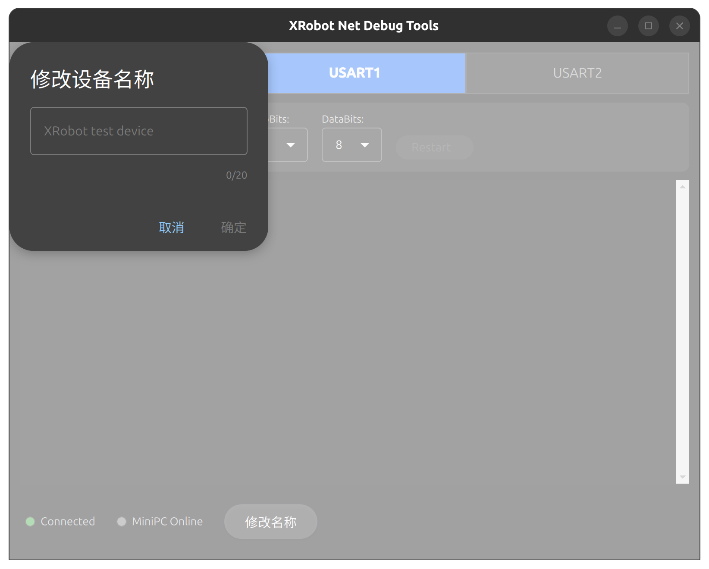
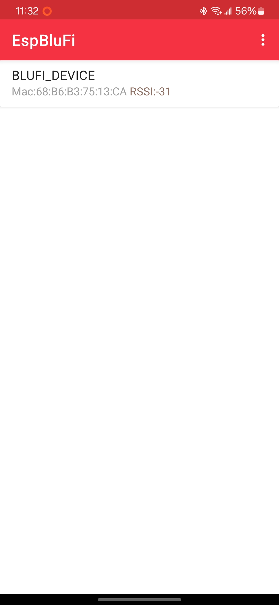
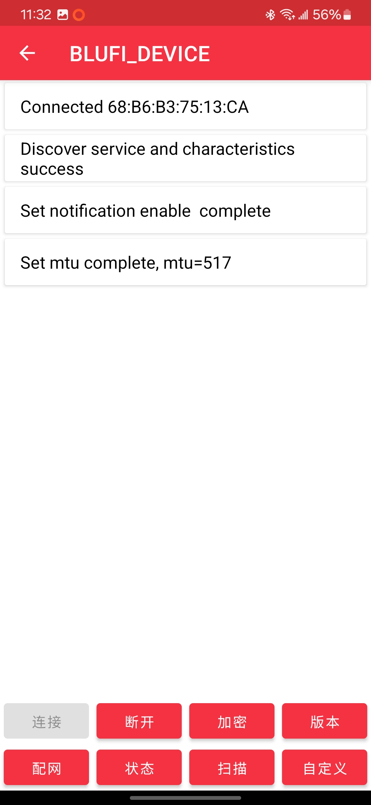

# NetDebugToolkit

**NetDebugToolkit** 是一个集合工具包，旨在帮助用户轻松实现基于 ESP32 的远程调试、WiFi 配置和串口通信。该工具集包含以下三大核心模块：

- **[NetDebugHost](https://github.com/Jiu-xiao/NetDebugHost)**: Linux 系统上的网络调试网桥
- **[NetDebugLink](https://github.com/Jiu-xiao/NetDebugLink)**: 基于 ESP32-C3 的多串口桥接模块
- **[NetDebugClient](https://github.com/Jiu-xiao/NetDebugClient)**: 跨平台桌面应用程序，提供终端与串口连接功能



---

## 📝 参考文档

- [NetDebugHost(Linux) 编译安装指南](https://github.com/Jiu-xiao/NetDebugHost/blob/master/README.md)
- [NetDebugLink(ESP32-C3) 编译烧录指南 & 引脚说明](https://github.com/Jiu-xiao/NetDebugLink/blob/master/README.md)
- [NetDebugClient(GUI 客户端) 编译安装指南](https://github.com/Jiu-xiao/NetDebugClient/blob/master/README.md)

---

## 🚀 使用方法

### 1. 连接与调试 ESP32 设备

- **NetDebugHost** 会自动识别并连接到接入的 ESP32 设备。你只需要通过 USB 将 ESP32 连接到 Linux 主机，`NetDebugHost` 服务启动后，程序会自动识别设备并启动调试 shell。DEB包在安装时会注册并开机启动服务，无需手动启动。

- 启动命令：

  ```bash
  sudo systemctl start netdebughost
  ```

- 查看服务状态：

  ```bash
  systemctl status netdebughost
  ```

### 2. 使用 NetDebugClient 进行远程调试

- **NetDebugClient** 提供了一个图形化终端界面实现终端交互。它支持对 Linux 系统进行远程重启，更改硬件串口配置等操作。

- 启动命令：
  - 在 Linux 上：

    ```bash
    chmod +x NetDebugClient-x86_64.AppImage
    ./NetDebugClient-x86_64.AppImage
    ```

  - 在 Windows 上：
    直接运行 `NetDebugClient.exe`。

- 设备查找：
  - 此处为设备名称的过滤器，当设备名称中包含此字符串时，会自动连接到该设备。
  - 

- Linux 上位机：
  - 点击`Restart`可以重启上位机
  - 上位机上的硬件串口配置不可以修改
  - Terminal窗口会转发上位机的一个bash shell，可以进行交互
  - 

- 硬件串口1/2：
  - 点击配置可以设置硬件串口的波特率，数据位，停止位，奇偶校验位
  - 硬件串口无法Restart
  - 

- 修改设备名称：
  - 连接后点击`修改名称`可以修改ESP32-C3设备名称，用于设备查找
  - 

### 3. 配置和管理 WiFi

- **NetDebugLink** 模块支持通过 BLUFI 协议进行远程 WiFi 配置。
  - 若配网成功且以及通过 USB 连接到 Linux 系统，会自动同步 WiFi 配置到 Linux 系统并尝试连接。
  - 开启配网模式：
    - 未连接到 WiFi 时，自动开启配网模式。
    - 连接到 WiFi 时，按下按键进入配网模式。

  - 蓝牙配网：使用EspBluFi App 进行配网。App可以在各大应用商店或[Github](https://github.com/EspressifApp/EspBlufiForAndroid/releases)下载

  |     |                              |                              |                              |
  | --- | ---------------------------- | ---------------------------- | ---------------------------- |
  |     |  |  |  |

---

## 📄 License

MIT License © 2025 Jiu-xiao
